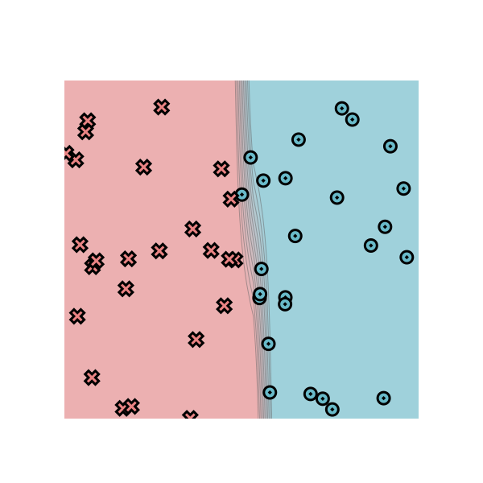
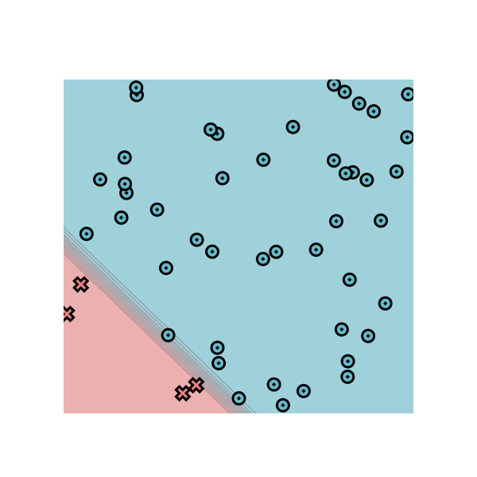
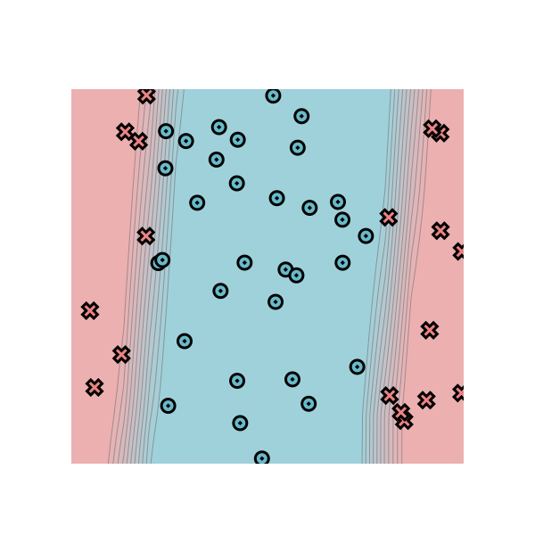
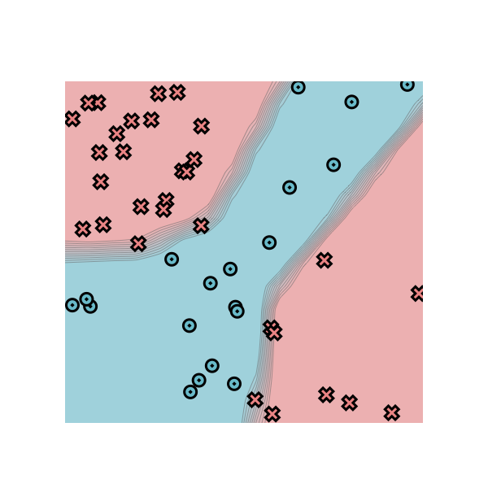
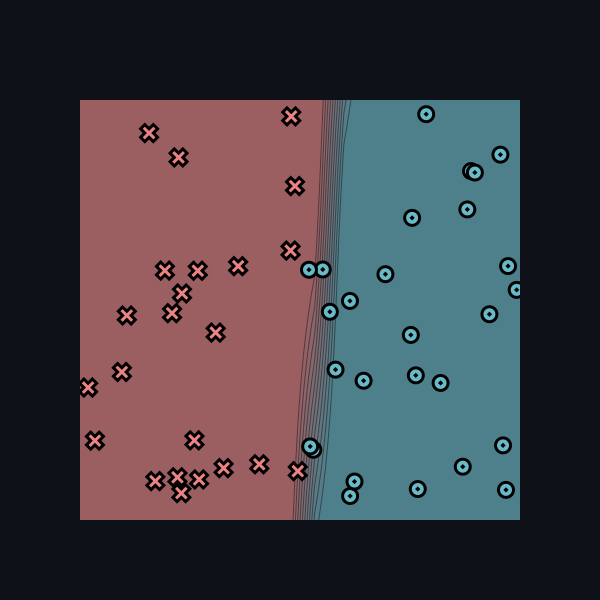
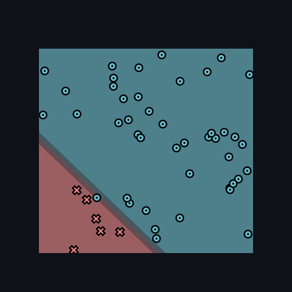
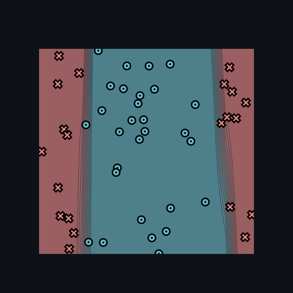
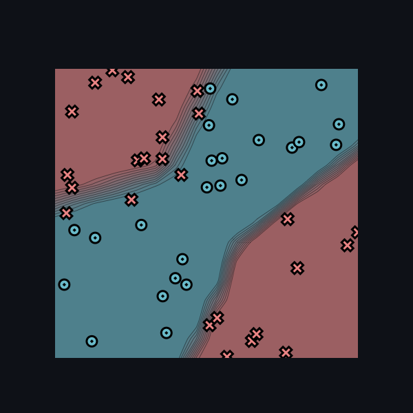

# minitorch
The full minitorch student suite. 

To access the autograder: 

* Module 0: https://classroom.github.com/a/qDYKZff9
* Module 1: https://classroom.github.com/a/6TiImUiy
* Module 2: https://classroom.github.com/a/0ZHJeTA0
* Module 3: https://classroom.github.com/a/U5CMJec1
* Module 4: https://classroom.github.com/a/04QA6HZK
* Quizzes: https://classroom.github.com/a/bGcGc12k

# Task 1.5: Training
## Simple
Epoch: 0/500, loss: 0, correct: 0 \
Epoch: 10/500, loss: 34.410284184815396, correct: 25 \
Epoch: 20/500, loss: 33.64994391146481, correct: 35 \
Epoch: 30/500, loss: 31.596788184396736, correct: 38 \
Epoch: 40/500, loss: 26.24454134210331, correct: 42 \
Epoch: 50/500, loss: 18.584860738211134, correct: 44 \
Epoch: 60/500, loss: 13.253958142946512, correct: 46 \
Epoch: 70/500, loss: 9.848883066217434, correct: 48 \
Epoch: 80/500, loss: 7.8072817027842945, correct: 50 \
Epoch: 90/500, loss: 16.917383626200603, correct: 41 \
Epoch: 100/500, loss: 8.336308833360357, correct: 48 \
Epoch: 110/500, loss: 10.617628926160636, correct: 44 \
Epoch: 120/500, loss: 9.3389613075958, correct: 44 \
Epoch: 130/500, loss: 8.148938853035359, correct: 47 \
Epoch: 140/500, loss: 8.196777523488622, correct: 47 \
Epoch: 150/500, loss: 7.8706815776846435, correct: 47 \
Epoch: 160/500, loss: 7.369811660584871, correct: 48 \
Epoch: 170/500, loss: 7.103611389446373, correct: 48 \
Epoch: 180/500, loss: 6.863841889425078, correct: 48 \
Epoch: 190/500, loss: 6.575354837109494, correct: 48 \
Epoch: 200/500, loss: 6.337907174218161, correct: 48 \
Epoch: 210/500, loss: 6.135195980832658, correct: 48 \
Epoch: 220/500, loss: 5.9299754674666305, correct: 48 \
Epoch: 230/500, loss: 5.756879433328494, correct: 48 \
Epoch: 240/500, loss: 5.604653636655635, correct: 48 \
Epoch: 250/500, loss: 5.3797144644063355, correct: 48 \
Epoch: 260/500, loss: 5.199288976612371, correct: 48 \
Epoch: 270/500, loss: 5.071661445657861, correct: 48 \
Epoch: 280/500, loss: 4.940532483172191, correct: 48 \
Epoch: 290/500, loss: 4.836891881372959, correct: 48 \
Epoch: 300/500, loss: 4.716060238234735, correct: 48 \
Epoch: 310/500, loss: 4.537204524018597, correct: 48 \
Epoch: 320/500, loss: 4.326956977081445, correct: 48 \
Epoch: 330/500, loss: 4.007934373357912, correct: 48 \
Epoch: 340/500, loss: 3.8350704186061915, correct: 48 \
Epoch: 350/500, loss: 4.215955805314945, correct: 48 \
Epoch: 360/500, loss: 6.524186501042643, correct: 48 \
Epoch: 370/500, loss: 5.587527378207099, correct: 48 \
Epoch: 380/500, loss: 1.859178052942396, correct: 49 \
Epoch: 390/500, loss: 1.597738053061419, correct: 50 \
Epoch: 400/500, loss: 1.4890895033704297, correct: 50 \
Epoch: 410/500, loss: 1.3942332499014984, correct: 50 \
Epoch: 420/500, loss: 1.309446095839808, correct: 50 \
Epoch: 430/500, loss: 1.233606148128, correct: 50 \
Epoch: 440/500, loss: 1.1652539438032274, correct: 50 \
Epoch: 450/500, loss: 1.1031995972078117, correct: 50 \
Epoch: 460/500, loss: 1.0466462958087188, correct: 50 \
Epoch: 470/500, loss: 0.99492511657924, correct: 50 \
Epoch: 480/500, loss: 0.9474660151621461, correct: 50 \
Epoch: 490/500, loss: 0.9037816309076641, correct: 50 \
Epoch: 500/500, loss: 0.86345384342962, correct: 50

## Diag
Epoch: 0/500, loss: 0, correct: 0 \
Epoch: 10/500, loss: 15.147253726963418, correct: 46 \
Epoch: 20/500, loss: 13.893345691094048, correct: 46 \
Epoch: 30/500, loss: 13.763155041987222, correct: 46 \
Epoch: 40/500, loss: 13.689230970877357, correct: 46 \
Epoch: 50/500, loss: 13.620792855252455, correct: 46 \
Epoch: 60/500, loss: 13.549843859231345, correct: 46 \
Epoch: 70/500, loss: 13.47435929320125, correct: 46 \
Epoch: 80/500, loss: 13.387258730267249, correct: 46 \
Epoch: 90/500, loss: 13.285569187922478, correct: 46 \
Epoch: 100/500, loss: 13.168172320859801, correct: 46 \
Epoch: 110/500, loss: 12.70672791293715, correct: 46 \
Epoch: 120/500, loss: 11.774728748752377, correct: 46 \
Epoch: 130/500, loss: 11.020015141379211, correct: 46 \
Epoch: 140/500, loss: 10.30455828765664, correct: 46 \
Epoch: 150/500, loss: 9.535807638988546, correct: 46 \
Epoch: 160/500, loss: 8.698414505211188, correct: 46 \
Epoch: 170/500, loss: 7.933307609880346, correct: 46 \
Epoch: 180/500, loss: 7.309606967982189, correct: 46 \
Epoch: 190/500, loss: 6.716021904583005, correct: 46 \
Epoch: 200/500, loss: 6.1703944258023595, correct: 46 \
Epoch: 210/500, loss: 5.706524901867203, correct: 46 \
Epoch: 220/500, loss: 5.350270986563201, correct: 46 \
Epoch: 230/500, loss: 4.962727773171834, correct: 46 \
Epoch: 240/500, loss: 4.622924076222443, correct: 46 \
Epoch: 250/500, loss: 4.310666162566053, correct: 46 \
Epoch: 260/500, loss: 4.025942740935214, correct: 48 \
Epoch: 270/500, loss: 3.767780788961387, correct: 49 \
Epoch: 280/500, loss: 3.5319085352277426, correct: 49 \
Epoch: 290/500, loss: 3.3182412734575593, correct: 49 \
Epoch: 300/500, loss: 3.1227946951816885, correct: 49 \
Epoch: 310/500, loss: 2.945163737102785, correct: 49 \
Epoch: 320/500, loss: 2.781627952504863, correct: 49 \
Epoch: 330/500, loss: 2.6326544311526385, correct: 49 \
Epoch: 340/500, loss: 2.495438295017074, correct: 49 \
Epoch: 350/500, loss: 2.3691676716338894, correct: 49 \
Epoch: 360/500, loss: 2.2679184256337277, correct: 49 \
Epoch: 370/500, loss: 2.1535413242892063, correct: 49 \
Epoch: 380/500, loss: 2.049293347114395, correct: 50 \
Epoch: 390/500, loss: 1.973941094218869, correct: 50 \
Epoch: 400/500, loss: 1.8822535550303723, correct: 50 \
Epoch: 410/500, loss: 1.7929372871637208, correct: 50 \
Epoch: 420/500, loss: 1.6971241927590537, correct: 50 \
Epoch: 430/500, loss: 1.6657423677488998, correct: 50 \
Epoch: 440/500, loss: 1.584841450124405, correct: 50 \
Epoch: 450/500, loss: 1.5008356306165327, correct: 50 \
Epoch: 460/500, loss: 1.4871893013046122, correct: 50 \
Epoch: 470/500, loss: 1.4122841383339277, correct: 50 \
Epoch: 480/500, loss: 1.3374775680867528, correct: 50 \
Epoch: 490/500, loss: 1.3674344100990696, correct: 50 \
Epoch: 500/500, loss: 1.3143922955285838, correct: 50

## Split
Epoch: 0/500, loss: 0, correct: 0 \
Epoch: 10/500, loss: 31.681527992867395, correct: 32 \
Epoch: 20/500, loss: 30.79436047882085, correct: 32 \
Epoch: 30/500, loss: 30.11797803522863, correct: 32 \
Epoch: 40/500, loss: 29.503267349352036, correct: 33 \
Epoch: 50/500, loss: 29.006494199244052, correct: 36 \
Epoch: 60/500, loss: 28.56437758846928, correct: 37 \
Epoch: 70/500, loss: 28.05828237207776, correct: 39 \
Epoch: 80/500, loss: 27.52013979485979, correct: 39 \
Epoch: 90/500, loss: 26.99089901241113, correct: 40 \
Epoch: 100/500, loss: 26.45472165576486, correct: 40 \
Epoch: 110/500, loss: 25.893233868313867, correct: 40 \
Epoch: 120/500, loss: 25.19388445307731, correct: 41 \
Epoch: 130/500, loss: 24.513339933979864, correct: 42 \
Epoch: 140/500, loss: 23.81807319875308, correct: 42 \
Epoch: 150/500, loss: 23.088173402308342, correct: 42 \
Epoch: 160/500, loss: 22.301767359522152, correct: 42 \
Epoch: 170/500, loss: 21.444117025992025, correct: 42 \
Epoch: 180/500, loss: 20.59254843123941, correct: 42 \
Epoch: 190/500, loss: 19.70422739482441, correct: 42 \
Epoch: 200/500, loss: 18.826448804577584, correct: 42 \
Epoch: 210/500, loss: 17.972343908413354, correct: 45 \
Epoch: 220/500, loss: 17.134824114136336, correct: 45 \
Epoch: 230/500, loss: 16.32074665909505, correct: 45 \
Epoch: 240/500, loss: 15.539376456921689, correct: 45 \
Epoch: 250/500, loss: 14.79016077648105, correct: 46 \
Epoch: 260/500, loss: 14.08306136489193, correct: 46 \
Epoch: 270/500, loss: 13.425534719097591, correct: 47 \
Epoch: 280/500, loss: 12.808025246425188, correct: 47 \
Epoch: 290/500, loss: 12.22812051199324, correct: 47 \
Epoch: 300/500, loss: 11.684288703585164, correct: 48 \
Epoch: 310/500, loss: 11.179115819809462, correct: 48 \
Epoch: 320/500, loss: 10.708688869020849, correct: 49 \
Epoch: 330/500, loss: 10.270826418605768, correct: 49 \
Epoch: 340/500, loss: 9.861725842314012, correct: 49 \
Epoch: 350/500, loss: 9.481809659818506, correct: 49 \
Epoch: 360/500, loss: 9.131155163068776, correct: 49 \
Epoch: 370/500, loss: 8.80433591409389, correct: 49 \
Epoch: 380/500, loss: 8.4988861270387, correct: 49 \
Epoch: 390/500, loss: 8.212995267569882, correct: 49 \
Epoch: 400/500, loss: 7.945435254917492, correct: 49 \
Epoch: 410/500, loss: 7.694250685044579, correct: 49 \
Epoch: 420/500, loss: 7.457998390467099, correct: 49 \
Epoch: 430/500, loss: 7.2367221496732554, correct: 49 \
Epoch: 440/500, loss: 7.028345904648977, correct: 49 \
Epoch: 450/500, loss: 6.831229148661652, correct: 50 \
Epoch: 460/500, loss: 6.645004564987301, correct: 50 \
Epoch: 470/500, loss: 6.468553306417633, correct: 50 \
Epoch: 480/500, loss: 6.301186599727213, correct: 50 \
Epoch: 490/500, loss: 6.142172791304635, correct: 50 \
Epoch: 500/500, loss: 5.990894712839817, correct: 50

## Xor
Epoch: 0/500, loss: 0, correct: 0 \
Epoch: 10/500, loss: 30.02340246283326, correct: 31 \
Epoch: 20/500, loss: 28.787448798527233, correct: 37 \
Epoch: 30/500, loss: 25.613918837959275, correct: 38 \
Epoch: 40/500, loss: 23.6944656574859, correct: 41 \
Epoch: 50/500, loss: 21.925840670829917, correct: 41 \
Epoch: 60/500, loss: 20.26453164574972, correct: 42 \
Epoch: 70/500, loss: 18.02683199337871, correct: 43 \
Epoch: 80/500, loss: 17.541973946830634, correct: 43 \
Epoch: 90/500, loss: 15.84663640494812, correct: 45 \
Epoch: 100/500, loss: 15.363073577869233, correct: 45 \
Epoch: 110/500, loss: 15.549360910058446, correct: 45 \
Epoch: 120/500, loss: 14.221806464136662, correct: 46 \
Epoch: 130/500, loss: 12.52206339461658, correct: 47 \
Epoch: 140/500, loss: 13.02578228939285, correct: 46 \
Epoch: 150/500, loss: 14.041200843344187, correct: 45 \
Epoch: 160/500, loss: 12.06920805440857, correct: 46 \
Epoch: 170/500, loss: 10.787297431831464, correct: 46 \
Epoch: 180/500, loss: 10.88019652639318, correct: 46 \
Epoch: 190/500, loss: 11.12357329977401, correct: 45 \
Epoch: 200/500, loss: 9.98314947157377, correct: 45 \
Epoch: 210/500, loss: 10.2062154006932, correct: 45 \
Epoch: 220/500, loss: 9.116554435656367, correct: 46 \
Epoch: 230/500, loss: 8.580774541301455, correct: 47 \
Epoch: 240/500, loss: 6.85581236411112, correct: 47 \
Epoch: 250/500, loss: 7.709911632164513, correct: 47 \
Epoch: 260/500, loss: 11.410745365289722, correct: 45 \
Epoch: 270/500, loss: 5.422125306359352, correct: 47 \
Epoch: 280/500, loss: 4.474731362662902, correct: 48 \
Epoch: 290/500, loss: 4.04876103630704, correct: 48 \
Epoch: 300/500, loss: 3.7531300053564447, correct: 48 \
Epoch: 310/500, loss: 3.585613170208969, correct: 49 \
Epoch: 320/500, loss: 3.420176606062045, correct: 49 \
Epoch: 330/500, loss: 6.268198415992016, correct: 47 \
Epoch: 340/500, loss: 4.5400994571073605, correct: 47 \
Epoch: 350/500, loss: 2.4004817998887362, correct: 50 \
Epoch: 360/500, loss: 2.1946578322788515, correct: 50 \
Epoch: 370/500, loss: 2.0109159063873236, correct: 50 \
Epoch: 380/500, loss: 1.848295711005952, correct: 50 \
Epoch: 390/500, loss: 1.753586009754573, correct: 50 \
Epoch: 400/500, loss: 1.8862100076434531, correct: 50 \
Epoch: 410/500, loss: 1.5901209738017983, correct: 50 \
Epoch: 420/500, loss: 1.6129752824907104, correct: 50 \
Epoch: 430/500, loss: 1.5596192806566387, correct: 50 \
Epoch: 440/500, loss: 1.4416552601971533, correct: 50 \
Epoch: 450/500, loss: 1.3223544773793925, correct: 50 \
Epoch: 460/500, loss: 1.4449341551604356, correct: 50 \
Epoch: 470/500, loss: 1.2305508872108588, correct: 50 \
Epoch: 480/500, loss: 1.2733143897814634, correct: 50 \
Epoch: 490/500, loss: 1.015909159766978, correct: 50 \
Epoch: 500/500, loss: 1.0155880674064057, correct: 50

# Task 2.5: Training
## Simple
Train time: 33 seconds. \
Epoch: 0/500, loss: 0, correct: 0 \
Epoch: 10/500, loss: 34.51041256554513, correct: 27 \
Epoch: 20/500, loss: 33.820320936474594, correct: 27 \
Epoch: 30/500, loss: 33.13731277319244, correct: 32 \
Epoch: 40/500, loss: 31.800894323808418, correct: 43 \
Epoch: 50/500, loss: 28.943650555136905, correct: 43 \
Epoch: 60/500, loss: 23.795739499778954, correct: 44 \
Epoch: 70/500, loss: 18.026728244657342, correct: 47 \
Epoch: 80/500, loss: 13.516206107093511, correct: 49 \
Epoch: 90/500, loss: 10.965295315552261, correct: 49 \
Epoch: 100/500, loss: 14.949739250436359, correct: 45 \
Epoch: 110/500, loss: 9.75982224192595, correct: 46 \
Epoch: 120/500, loss: 10.032847820559965, correct: 46 \
Epoch: 130/500, loss: 7.057236345528738, correct: 49 \
Epoch: 140/500, loss: 8.24815500797534, correct: 46 \
Epoch: 150/500, loss: 7.291708510700708, correct: 48 \
Epoch: 160/500, loss: 6.4228737303300685, correct: 49 \
Epoch: 170/500, loss: 6.248294803395315, correct: 48 \
Epoch: 180/500, loss: 6.232072310264038, correct: 48 \
Epoch: 190/500, loss: 7.779309782360227, correct: 47 \
Epoch: 200/500, loss: 7.114120410858874, correct: 47 \
Epoch: 210/500, loss: 4.969199738640375, correct: 49 \
Epoch: 220/500, loss: 5.314282772141762, correct: 49 \
Epoch: 230/500, loss: 8.600133084311873, correct: 45 \
Epoch: 240/500, loss: 5.187481005673506, correct: 49 \
Epoch: 250/500, loss: 4.3824975259069054, correct: 49 \
Epoch: 260/500, loss: 5.806921182033377, correct: 47 \
Epoch: 270/500, loss: 7.198764222559132, correct: 47 \
Epoch: 280/500, loss: 4.1640444847466895, correct: 49 \
Epoch: 290/500, loss: 4.1908086430222555, correct: 49 \
Epoch: 300/500, loss: 7.168683074765014, correct: 46 \
Epoch: 310/500, loss: 4.950084640792982, correct: 49 \
Epoch: 320/500, loss: 3.668578438853513, correct: 49 \
Epoch: 330/500, loss: 4.464336086997311, correct: 49 \
Epoch: 340/500, loss: 7.379301476237241, correct: 46 \
Epoch: 350/500, loss: 3.684505552871727, correct: 49 \
Epoch: 360/500, loss: 3.4240583911945515, correct: 49 \
Epoch: 370/500, loss: 6.203346143491324, correct: 47 \
Epoch: 380/500, loss: 4.93632645220292, correct: 49 \
Epoch: 390/500, loss: 3.0878887441773717, correct: 49 \
Epoch: 400/500, loss: 3.161184442919254, correct: 49 \
Epoch: 410/500, loss: 8.894239676209297, correct: 46 \
Epoch: 420/500, loss: 3.590912875357981, correct: 49 \
Epoch: 430/500, loss: 2.8192353285143175, correct: 49 \
Epoch: 440/500, loss: 3.041944738065133, correct: 49 \
Epoch: 450/500, loss: 9.561071629030556, correct: 46 \
Epoch: 460/500, loss: 3.081041454114483, correct: 49 \
Epoch: 470/500, loss: 2.6342079891638708, correct: 49 \
Epoch: 480/500, loss: 2.856986167295984, correct: 49 \
Epoch: 490/500, loss: 9.757647624426697, correct: 46 \
Epoch: 500/500, loss: 2.8344403201117383, correct: 49

## Diag
Train time: 33 seconds. \
Epoch: 0/500, loss: 0, correct: 0 \
Epoch: 10/500, loss: 18.478419524824563, correct: 44 \
Epoch: 20/500, loss: 16.62259041656392, correct: 44 \
Epoch: 30/500, loss: 15.492108880396495, correct: 44 \
Epoch: 40/500, loss: 14.215929889816294, correct: 44 \
Epoch: 50/500, loss: 12.685339822341046, correct: 44 \
Epoch: 60/500, loss: 10.95519908712014, correct: 44 \
Epoch: 70/500, loss: 9.203497210432273, correct: 44 \
Epoch: 80/500, loss: 7.69825637552954, correct: 45 \
Epoch: 90/500, loss: 6.64971716692766, correct: 46 \
Epoch: 100/500, loss: 5.823254240831767, correct: 48 \
Epoch: 110/500, loss: 5.18621138750014, correct: 49 \
Epoch: 120/500, loss: 4.714700518952672, correct: 50 \
Epoch: 130/500, loss: 4.337292490919084, correct: 50 \
Epoch: 140/500, loss: 4.013591140921118, correct: 50 \
Epoch: 150/500, loss: 3.7284687297070356, correct: 50 \
Epoch: 160/500, loss: 3.476388156326025, correct: 50 \
Epoch: 170/500, loss: 3.2529726361125078, correct: 50 \
Epoch: 180/500, loss: 3.0545622831933916, correct: 50 \
Epoch: 190/500, loss: 2.877994473378574, correct: 50 \
Epoch: 200/500, loss: 2.7204945016526123, correct: 50 \
Epoch: 210/500, loss: 2.5796164293248314, correct: 50 \
Epoch: 220/500, loss: 2.4532057303234716, correct: 50 \
Epoch: 230/500, loss: 2.339371065086603, correct: 50 \
Epoch: 240/500, loss: 2.2364596746362606, correct: 50 \
Epoch: 250/500, loss: 2.1430341610297754, correct: 50 \
Epoch: 260/500, loss: 2.0578499786630626, correct: 50 \
Epoch: 270/500, loss: 1.9798336860158288, correct: 50 \
Epoch: 280/500, loss: 1.9080622786981283, correct: 50 \
Epoch: 290/500, loss: 1.8417439484073572, correct: 50 \
Epoch: 300/500, loss: 1.7802005204445834, correct: 50 \
Epoch: 310/500, loss: 1.722851696884011, correct: 50 \
Epoch: 320/500, loss: 1.6692011176052666, correct: 50 \
Epoch: 330/500, loss: 1.6188241653013884, correct: 50 \
Epoch: 340/500, loss: 1.5713573859541166, correct: 50 \
Epoch: 350/500, loss: 1.5264893683887186, correct: 50 \
Epoch: 360/500, loss: 1.4839529182408084, correct: 50 \
Epoch: 370/500, loss: 1.4435183660870394, correct: 50 \
Epoch: 380/500, loss: 1.4049878610650475, correct: 50 \
Epoch: 390/500, loss: 1.368190516090396, correct: 50 \
Epoch: 400/500, loss: 1.3329782862531119, correct: 50 \
Epoch: 410/500, loss: 1.2992224767305145, correct: 50 \
Epoch: 420/500, loss: 1.266810789934676, correct: 50 \
Epoch: 430/500, loss: 1.2356448334420813, correct: 50 \
Epoch: 440/500, loss: 1.205638020602029, correct: 50 \
Epoch: 450/500, loss: 1.1767138047658219, correct: 50 \
Epoch: 460/500, loss: 1.148804196016138, correct: 50 \
Epoch: 470/500, loss: 1.1218485162748142, correct: 50 \
Epoch: 480/500, loss: 1.0957923548593667, correct: 50 \
Epoch: 490/500, loss: 1.070586692039057, correct: 50 \
Epoch: 500/500, loss: 1.0461871629794803, correct: 50

## Split
Train time: 224 seconds. \
Epoch: 0/500, loss: 0, correct: 0 \
Epoch: 10/500, loss: 33.51534643493197, correct: 30 \
Epoch: 20/500, loss: 32.870969233504574, correct: 30 \
Epoch: 30/500, loss: 31.879046805885746, correct: 32 \
Epoch: 40/500, loss: 30.968297635592908, correct: 39 \
Epoch: 50/500, loss: 29.939663850680688, correct: 35 \
Epoch: 60/500, loss: 26.81719401734741, correct: 37 \
Epoch: 70/500, loss: 23.871176922997932, correct: 41 \
Epoch: 80/500, loss: 20.971497741160356, correct: 43 \
Epoch: 90/500, loss: 19.686951054510516, correct: 45 \
Epoch: 100/500, loss: 18.48926917046074, correct: 41 \
Epoch: 110/500, loss: 17.801078767642352, correct: 40 \
Epoch: 120/500, loss: 16.043170117740793, correct: 40 \
Epoch: 130/500, loss: 14.907333318531114, correct: 41 \
Epoch: 140/500, loss: 15.896941619682933, correct: 41 \
Epoch: 150/500, loss: 10.27846828545837, correct: 46 \
Epoch: 160/500, loss: 8.172872345008363, correct: 47 \
Epoch: 170/500, loss: 17.109738721630663, correct: 41 \
Epoch: 180/500, loss: 5.892477150622451, correct: 48 \
Epoch: 190/500, loss: 4.014672333892285, correct: 50 \
Epoch: 200/500, loss: 3.4453601569090857, correct: 50 \
Epoch: 210/500, loss: 3.034364142306125, correct: 50 \
Epoch: 220/500, loss: 2.714940205841151, correct: 50 \
Epoch: 230/500, loss: 2.4684555786625335, correct: 50 \
Epoch: 240/500, loss: 2.3279839969132854, correct: 50 \
Epoch: 250/500, loss: 2.723120500437978, correct: 49 \
Epoch: 260/500, loss: 103.70263795567968, correct: 29 \
Epoch: 270/500, loss: 6.235799495088109, correct: 50 \
Epoch: 280/500, loss: 3.194444734566975, correct: 50 \
Epoch: 290/500, loss: 2.6168639052667126, correct: 50 \
Epoch: 300/500, loss: 2.285182577794794, correct: 50 \
Epoch: 310/500, loss: 2.0385776351796574, correct: 50 \
Epoch: 320/500, loss: 1.844292386167797, correct: 50 \
Epoch: 330/500, loss: 1.6849337031641993, correct: 50 \
Epoch: 340/500, loss: 1.5510801876805111, correct: 50 \
Epoch: 350/500, loss: 1.436618613428864, correct: 50 \
Epoch: 360/500, loss: 1.3373789240487814, correct: 50 \
Epoch: 370/500, loss: 1.2500469727693713, correct: 50 \
Epoch: 380/500, loss: 1.1717894257140717, correct: 50 \
Epoch: 390/500, loss: 1.101901921074846, correct: 50 \
Epoch: 400/500, loss: 1.0389187855575244, correct: 50 \
Epoch: 410/500, loss: 0.9817565184125465, correct: 50 \
Epoch: 420/500, loss: 0.9297165705315837, correct: 50 \
Epoch: 430/500, loss: 0.8821127408706908, correct: 50 \
Epoch: 440/500, loss: 0.8383906115457945, correct: 50 \
Epoch: 450/500, loss: 0.7980860937153975, correct: 50 \
Epoch: 460/500, loss: 0.7608117899746214, correct: 50 \
Epoch: 470/500, loss: 0.7262416471557499, correct: 50 \
Epoch: 480/500, loss: 0.694056483539589, correct: 50 \
Epoch: 490/500, loss: 0.6640547867101049, correct: 50 \
Epoch: 500/500, loss: 0.636030998458366, correct: 50

## Xor
Train time: 235 seconds. \
Epoch: 0/500, loss: 0, correct: 0 \
Epoch: 10/500, loss: 31.507691463776194, correct: 33 \
Epoch: 20/500, loss: 30.25009923069595, correct: 34 \
Epoch: 30/500, loss: 29.11310741814506, correct: 34 \
Epoch: 40/500, loss: 27.896940362036798, correct: 35 \
Epoch: 50/500, loss: 30.35888404810178, correct: 28 \
Epoch: 60/500, loss: 26.906767371203305, correct: 41 \
Epoch: 70/500, loss: 28.84511829642539, correct: 34 \
Epoch: 80/500, loss: 24.171000500167906, correct: 38 \
Epoch: 90/500, loss: 25.71086060465319, correct: 36 \
Epoch: 100/500, loss: 21.68954783027885, correct: 40 \
Epoch: 110/500, loss: 18.716136036940657, correct: 44 \
Epoch: 120/500, loss: 17.371442884108593, correct: 43 \
Epoch: 130/500, loss: 17.12141745372546, correct: 44 \
Epoch: 140/500, loss: 16.378284764204622, correct: 44 \
Epoch: 150/500, loss: 15.929610046370803, correct: 44 \
Epoch: 160/500, loss: 13.745740668497099, correct: 44 \
Epoch: 170/500, loss: 13.987835175176876, correct: 43 \
Epoch: 180/500, loss: 14.17637982359944, correct: 43 \
Epoch: 190/500, loss: 12.783386408070276, correct: 44 \
Epoch: 200/500, loss: 12.574527812198907, correct: 44 \
Epoch: 210/500, loss: 12.664273369389875, correct: 44 \
Epoch: 220/500, loss: 11.93201839272133, correct: 44 \
Epoch: 230/500, loss: 11.305911651584013, correct: 44 \
Epoch: 240/500, loss: 11.894074734870516, correct: 45 \
Epoch: 250/500, loss: 10.41557493993434, correct: 45 \
Epoch: 260/500, loss: 13.488811769632564, correct: 45 \
Epoch: 270/500, loss: 14.71326403302139, correct: 45 \
Epoch: 280/500, loss: 10.575853430099562, correct: 46 \
Epoch: 290/500, loss: 9.153528144015063, correct: 45 \
Epoch: 300/500, loss: 9.451120366612487, correct: 45 \
Epoch: 310/500, loss: 15.849074732057165, correct: 42 \
Epoch: 320/500, loss: 9.35135220643947, correct: 46 \
Epoch: 330/500, loss: 12.05809162894541, correct: 45 \
Epoch: 340/500, loss: 7.839547407374594, correct: 47 \
Epoch: 350/500, loss: 7.36557541958354, correct: 47 \
Epoch: 360/500, loss: 7.080420612267056, correct: 47 \
Epoch: 370/500, loss: 6.943018418847969, correct: 47 \
Epoch: 380/500, loss: 9.802971024918465, correct: 45 \
Epoch: 390/500, loss: 15.325096278410737, correct: 44 \
Epoch: 400/500, loss: 6.79163439903159, correct: 48 \
Epoch: 410/500, loss: 6.420838194012306, correct: 48 \
Epoch: 420/500, loss: 6.177262694584946, correct: 48 \
Epoch: 430/500, loss: 6.9299262540575866, correct: 46 \
Epoch: 440/500, loss: 15.59088786836238, correct: 44 \
Epoch: 450/500, loss: 8.148051793969673, correct: 47 \
Epoch: 460/500, loss: 6.53163027372872, correct: 47 \
Epoch: 470/500, loss: 7.131701697947054, correct: 47 \
Epoch: 480/500, loss: 9.430525000433533, correct: 46 \
Epoch: 490/500, loss: 8.83869557861201, correct: 46 \
Epoch: 500/500, loss: 7.67886697644555, correct: 47

